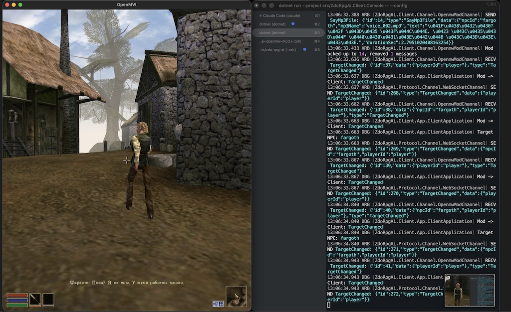

# Zdo RPG AI

System to make NPCs in the RPG alive.



This is evolution of https://github.com/drzdo/immersive_morrowind_llm_ai

Right now this mod is primarily focused on Morrowind. But I would like to keep it extandable for other games as well.

# Instructions

## Simple deployment example

1. Install native build and runtime dependencies:

```sh
sudo apt install -y clang ffmpeg zlib1g-dev
```

2. Install .NET 9 SDK.

This project targets `net9.0`. If your distro does not provide `.NET 9` packages, install it with `dotnet-install`:

```sh
mkdir -p "$HOME/.dotnet"
curl -fsSL https://dot.net/v1/dotnet-install.sh -o /tmp/dotnet-install.sh
bash /tmp/dotnet-install.sh --channel 9.0 --install-dir "$HOME/.dotnet"
export PATH="$HOME/.dotnet:$PATH"
```

3. Publish the self-contained Linux server binary:

```sh
dotnet publish src/ZdoRpgAi.Server.Console/ZdoRpgAi.Server.Console.csproj \
	-c Release \
	-r linux-x64 \
	--self-contained true \
	-o "$PWD/.publish/server"
```

4. Create the deployment layout, service user, and install the published files:

```sh
sudo mkdir -p /opt/zdo-rpg-ai/bin /opt/zdo-rpg-ai/config /opt/zdo-rpg-ai/data /opt/zdo-rpg-ai/logs
sudo useradd --system --home /opt/zdo-rpg-ai --shell /usr/sbin/nologin zdo-rpg-ai || true
sudo cp -a .publish/server/. /opt/zdo-rpg-ai/bin/
sudo chown -R zdo-rpg-ai:zdo-rpg-ai /opt/zdo-rpg-ai
sudo chmod -R 750 /opt/zdo-rpg-ai
```

5. Generate a shared client token.

The same token must be used by the server and every client bridge that connects to it.

```sh
openssl rand -hex 32
```

Example output:

```text
0123456789abcdef0123456789abcdef0123456789abcdef0123456789abcdef
```

6. Create server config file: `/opt/zdo-rpg-ai/config/server-config.yaml`.

Minimal configuration that boots the service with dummy providers:

```yaml
log:
  consoleLevel: info
  fileLevel: info
  filePath: /opt/zdo-rpg-ai/logs/server.log

database:
  mainDbPath: /opt/zdo-rpg-ai/data/main.db
  saveGameDbPath: /opt/zdo-rpg-ai/data/save.db

httpServer:
  host: 0.0.0.0
  port: 8080
  maxMessageSize: 10485760
  rpcTimeoutMs: 5000
  clientToken: "0123456789abcdef0123456789abcdef0123456789abcdef0123456789abcdef"

tts:
  provider: dummy
  mp3Speed:
    ffmpegExePath: /usr/bin/ffmpeg
    charactersPerSecond: 15

stt:
  provider: dummy

director:
  compactThreshold: 30
  compactKeepRecent: 10

llm:
  main:
    provider: dummy
  simple:
    provider: dummy
```

Replace the example `clientToken` with the value generated in the previous step.

7. Create the systemd service:

```ini
[Unit]
Description=zdo-rpg-ai server
After=network-online.target
Wants=network-online.target

[Service]
Type=simple
User=zdo-rpg-ai
Group=zdo-rpg-ai
WorkingDirectory=/opt/zdo-rpg-ai
ExecStart=/opt/zdo-rpg-ai/bin/ZdoRpgAi.Server.Console --config /opt/zdo-rpg-ai/config/server-config.yaml
Restart=always
RestartSec=5
Environment=DOTNET_EnableDiagnostics=0

[Install]
WantedBy=multi-user.target
```

```sh
sudo systemctl daemon-reload
sudo systemctl enable --now zdo-rpg-ai
```

8. Verify the server is alive:

```sh
curl http://127.0.0.1:8080/ping
```

Expected response: `pong`

The dummy provider setup is enough to validate deployment and mod connectivity. For real gameplay you still need to replace dummy providers with actual `tts`, `stt`, and `llm` providers in the server config.

To enable real providers, replace `dummy` with supported providers and add the required credentials to the matching config sections:

- `tts`: `elevenlabs`
- `stt`: `deepgram`
- `llm.main` and `llm.simple`: `gemini` or `openai`

Use [example/server-config.example.yaml](example/server-config.example.yaml) as the reference for the provider-specific fields.

## Client configuration

The server does not connect to OpenMW directly. The expected setup is:

- the server runs on a Linux machine
- OpenMW runs on the game machine
- `ZdoRpgAi.Client.Console` runs on the game machine and bridges the game mod to the server

For OpenMW, add the mod to `openmw.cfg`:

```ini
data="/path/to/zdo-rpg-ai-openmw-mod/zdorpgai"
content=zdorpgai.omwscripts
```

Create a client config file on the machine where OpenMW is running:

```yaml
server:
	host: <SERVER_IP>
	port: 8080
	clientToken: "replace-with-the-same-token"

mod:
	provider: openmw
	openmw:
		dataDir: /path/to/zdo-rpg-ai-openmw-mod/zdorpgai
		logFilePath: /path/to/openmw.log
```

Notes:

- `host` and `port` must point to the deployed server
- `clientToken` must match `httpServer.clientToken` from the server config exactly
- `dataDir` must match the mod directory registered in `openmw.cfg`
- `logFilePath` must point to the real OpenMW log file on the game machine

Run the client bridge on the game machine:

```sh
dotnet run --project src/ZdoRpgAi.Client.Console -- --config /path/to/client-config.yaml
```

If the server is reachable and the OpenMW side is configured correctly, the client should connect to `ws://<SERVER_IP>:8080/ws`, write IPC files into the mod directory, and wait for the OpenMW mod handshake. In game, the expected confirmation is `ZdoRPG connected`.

## Example local run

```sh
dotnet run --project src/ZdoRpgAi.Server.Console -- --config .tmp/server-config.yaml
dotnet run --project src/ZdoRpgAi.Client.Console -- --config .tmp/client-config.yaml
```

Game mods:

- Morrowind OpenMW https://github.com/drzdo/zdo-rpg-ai-openmw-mod
